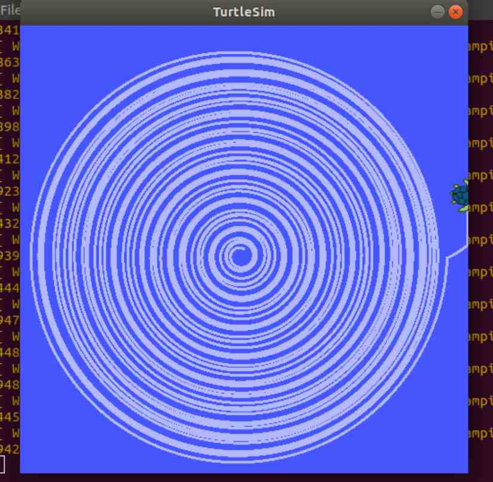

# 🎯 Task 1: ROS 2 Basics (Pub/Sub, Services, and Turtlesim)

## Task 1.1A: Publisher and Subscriber (Python Implementation)

1. **Follow the Tutorial:** Refer to the *Writing a Simple Publisher and Subscriber (Python)* tutorial in the official ROS 2 documentation.
2. **Message Format:** Modify the publisher to publish messages in the following format:
    ```text
    "Communication is working smoothly! Ping no. %d"
    ```
    *(where `%d` is an integer incrementing by 1 each message).*
    
3. **Video Submission:** Record a video showing the Python publisher and subscriber working together side-by-side in your terminal, clearly displaying the published and received messages.

---

## Task 1.1B: Create a ROS 2 Service Node

### **Task Description:**
Write a ROS service node in Python that responds with a message every time it is triggered from another terminal. It should do the following:
- Define a custom service with an empty request and a string response.
- When the service is called, it should:
    - Print a message to the terminal running the service.
    - Respond to the client with:
        `"Your service is currently active and has been called for X times."`
        *(Where **X** is the number of times the service has been triggered since it started).*

**Resource:** [Official ROS 2 Python Service Documentation](https://docs.ros.org/en/ros2_documentation/humble/Tutorials/Beginner-Client-Libraries/Writing-A-Simple-Py-Service-And-Client.html)

<p align="center">
  
</p>

### **Hints:**
- Use `rclpy`, the Python client library for ROS 2.
- Use a counter variable that increments every time the service callback is executed.
- Create a custom service type (or use `std_srvs/srv/Trigger` for simplicity if you prefer not to define a custom `.srv` file).

### **Submission Guidelines:**
- Record a video showing two terminals side-by-side: one running the service node and the other executing the service call.
- Compress your package folder as a `.zip` file for submission.

---

## Task 1.3: Turtlesim Spiral



### 1. Problem Statement
The objective of this task is to install and use the `turtlesim` package and `rqt` tools to prepare for upcoming tasks. Turtlesim is a lightweight simulator for learning ROS 2. It illustrates what ROS 2 does at the most basic level to give you an idea of what you will do with a real robot or a robot simulation later on.

### **Create a spiral on Turtlesim.**
- **Create a new ROS 2 package** named `turtlesim_spiral`
- **Within that package**, create a node called `turtle_spiral_node`
- **Write a Python script** in `turtle_spiral_node` that makes the Turtle follow a spiral trajectory in `turtlesim`. *(Hint: constantly increase the linear velocity while keeping angular velocity constant, or vice versa!)*
- **Verify the node and topic structure** in `rqt_graph` to ensure everything is connected correctly.

### 2. Expected Output & Submission
- **Record a terminal session video** showing:
    - Launching `turtlesim_node`
    - Running `turtle_spiral_node` and observing the spiral motion.
- **Capture a screenshot** of the `rqt_graph` displaying your package’s nodes and topics.

*(Follow the official ROS 2 docs for detailed Turtlesim instructions if needed).*

---

## 📥 Submit Your Work

1. Create a folder named `<YourName>_Task-1`.
2. Place all your videos, screenshots, and `.zip` files inside, and compress the folder into a `.zip`.
3. Upload the `.zip` file to **Google Drive** and set the sharing permissions to **"Anyone with the link can view"**.
4. Submit your Google Drive link to the respective forms below:

- 📝 **[Task 1.1A Submission Form](https://forms.gle/M68prYEGxKgHrnA38)**
- 📝 **[Task 1.1B Submission Form](https://docs.google.com/forms/d/e/1FAIpQLSdscQ7079BTx7KRFdv--LLydYA1E581htcmM8tpuAcyrcqWAA/viewform?usp=publish-editor)**
- 📝 **[Task 1.3 Submission Form](https://docs.google.com/forms/d/e/1FAIpQLScV5yRR90A47QVsMTqBOtsWA49gqGYNVMr3euNIuCLcedbKCg/viewform?usp=publish-editor)**

---
⬅️ **[Back: Learning Resources](./Learning_Resources.md)** | ➡️ **[Next: Task 2 - Drone Square Mission](./Task_2_Drone_Square.md)**
