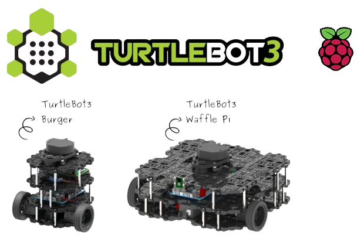

# 🐢 TurtleBot3 and Simulation

## What is a TurtleBot3?

TurtleBot3 is a small, affordable, programmable, ROS-based mobile robot for use in education, research, hobby, and product prototyping. The goal of TurtleBot3 is to dramatically reduce the size of the platform and lower the price without having to sacrifice its functionality and quality, while at the same time offering expandability. The TurtleBot3 can be customized in various ways depending on how you reconstruct the mechanical parts and use optional parts such as the computer and sensor. In addition, TurtleBot3 is evolved with cost-effective and small-sized SBC that is suitable for robust embedded systems, 360-degree distance sensors, and 3D printing technology.



The TurtleBot3’s core technology is SLAM, Navigation, and Manipulation, making it suitable for home service robots. The TurtleBot can run SLAM (Simultaneous Localization and Mapping) algorithms to build a map and can drive around your room. Also, it can be controlled remotely from a laptop, joypad, or Android-based smartphone. The TurtleBot can also follow a person’s legs as they walk in a room. Also, the TurtleBot3 can be used as a mobile manipulator capable of manipulating an object by attaching a manipulator like OpenMANIPULATOR. The OpenMANIPULATOR has the advantage of being compatible with TurtleBot3 Waffle and Waffle Pi. Through this compatibility, it can compensate for the lack of freedom and can have greater completeness as a service robot with the SLAM and navigation capabilities that the TurtleBot3 has.

### Key Features
- **Modular Hardware**: Comes in three main models—Burger, Waffle Pi, and Waffle—each with different payload, sensor, and computing options.
- **Open-Source Software**: ROS 2 packages (`turtlebot3` and `turtlebot3_simulations`) provide drivers, navigation, SLAM, and simulation support.
- **Compact & Lightweight**: Easy to carry and suitable for research labs or classrooms.
- **Customizable**: Additional sensors (LIDAR, camera, IMU) and accessories can be integrated.

### Software Architecture
- **ROS 2 Nodes**: `turtlebot3_driver`, `turtlebot3_node`, `teleop_twist_keyboard`, etc.
- **Launch Files**: Preconfigured `.launch.py` scripts for bringing up core nodes, sensors, and simulation.
- **Applications**: Examples for SLAM (GMapping), navigation (AMCL), and teleoperation.

<p align="center">
  
</p>

---

## 🛠️ Installation Guide

*Please follow the instructions based on your Operating System:*
- [For Windows / Ubuntu Users (Gazebo 11 Classic)](#for-windows--ubuntu-users-gazebo-11)
- [For MAC Users (Gazebo Ignition Fortress)](#for-mac-users-gazebo-ignition)

---

## 🪟 For Windows / Ubuntu Users (Gazebo 11)

### Install TurtleBot3 Simulation

#### 1. Create Workspace & Clone Repos
```bash
mkdir -p ~/turtlebot3_ws/src && cd ~/turtlebot3_ws/src

git clone -b humble-devel https://github.com/ROBOTIS-GIT/DynamixelSDK.git
git clone -b humble-devel https://github.com/ROBOTIS-GIT/turtlebot3_msgs.git
git clone -b humble-devel https://github.com/ROBOTIS-GIT/turtlebot3.git
git clone -b humble-devel https://github.com/ROBOTIS-GIT/turtlebot3_simulations.git
```

#### 2. Install Dependencies & Build
```bash
cd ~/turtlebot3_ws
sudo rosdep init  # skip if already done
rosdep update
rosdep install --from-paths src --ignore-src --rosdistro humble -y
colcon build --symlink-install
```

#### 3. Setup Environment Variables
Add to `~/.bashrc`:
```bash
echo 'source /opt/ros/humble/setup.bash' >> ~/.bashrc
echo 'source ~/turtlebot3_ws/install/setup.bash' >> ~/.bashrc
echo 'export TURTLEBOT3_MODEL=burger' >> ~/.bashrc
echo 'export GAZEBO_MODEL_PATH=$GAZEBO_MODEL_PATH:~/turtlebot3_ws/src/turtlebot3_simulations/turtlebot3_gazebo/models' >> ~/.bashrc
```

Apply changes:
```bash
source ~/.bashrc
```

#### 4. Choose a TurtleBot3 Model
Set `TURTLEBOT3_MODEL` per desired robot:
- **burger** (small, LiDAR)
- **waffle** (RGB-D camera + LiDAR)
- **waffle_pi** (alternate camera setup)

```bash
export TURTLEBOT3_MODEL=waffle
```

#### 5. Running Basic Simulations
- **Empty World:**
    ```bash
    ros2 launch turtlebot3_gazebo empty_world.launch.py
    ```
- **TurtleBot3 World:**
    ```bash
    ros2 launch turtlebot3_gazebo turtlebot3_world.launch.py
    ```
- **House World:**
    ```bash
    ros2 launch turtlebot3_gazebo turtlebot3_house.launch.py
    ```

#### 6. Teleoperating the Simulated Robot
In a new terminal:
```bash
export TURTLEBOT3_MODEL=burger
ros2 run turtlebot3_teleop teleop_keyboard
```

**Key Controls:**
- `w/x`: increase/decrease linear velocity
- `a/d`: increase/decrease angular velocity
- `s`: stop
- `Ctrl+C`: exit

---

## 🍎 For MAC Users (Gazebo Ignition)

### 🐢 TurtleBot3 Gazebo Fortress Simulation
ROS 2 package for simulating TurtleBot3 in Gazebo Fortress with Ignition Bridge. *"Making robot simulation as easy as blinking!"* 

### Dependencies Installation & Custom Package Setup
Follow these steps to install dependencies, clone a custom TurtleBot3 repo, and integrate model assets:

#### Step 1: Install ROS 2 & Gazebo Dependencies
```bash
sudo apt update
sudo apt install ros-humble-desktop ros-humble-gazebo-ros-pkgs
```

#### Step 2: Clone Custom TurtleBot3 Package
```bash
mkdir -p ~/turtlebot3_ws/src
cd ~/turtlebot3_ws/src
git clone https://github.com/Diwakar-Saini/turtlebot3.git
```

#### Step 3: Download & Place Model Assets
1. Download the model folder *(Link will be provided separately)*.
2. Extract and copy the `models/` directory into:
    `~/turtlebot3_ws/src/turtlebot3_simulations/turtlebot3_gazebo/models/`

#### Step 4: Install Ignition Bridge Packages
```bash
sudo apt update && sudo apt install -y \
ros-humble-ros-ign ros-humble-ros-ign-bridge \
ros-humble-ros-ign-gazebo ros-humble-ros-ign-gazebo-demos \
ros-humble-ros-ign-image ignition-fortress
```

#### Step 5: Build & Source Workspace
```bash
# Ensure Dynamixel SDK is available
sudo apt-get install ros-humble-dynamixel-sdk
# Install remaining dependencies and build
cd ~/turtlebot3_ws
rosdep install --from-paths src --ignore-src -r -y
colcon build
source install/setup.bash
```

#### Step 6: Verify Simulation & Teleop

##### Environment Configuration
Add the following to your `~/.bashrc` to configure the TurtleBot3 model. **Uncomment only one model at a time.**

```bash
# TurtleBot3 Model Configuration
# Uncomment only one model at a time for use

# For the burger model (smallest)
export TURTLEBOT3_MODEL=burger

# For the waffle model
# export TURTLEBOT3_MODEL=waffle

# For the waffle_pi model (with Pi Camera)
# export TURTLEBOT3_MODEL=waffle_pi
```

> **Tip:** After editing ~/.bashrc, apply the changes by running:
> ```bash
> source ~/.bashrc
> ```

---

### TurtleBot3 Gazebo Launch Commands

**1. Empty World**
Launch TurtleBot3 in an empty Gazebo world:
```bash
ros2 launch turtlebot3_gazebo empty_world.launch.py
```

**2. Default TurtleBot3 World**
Launch TurtleBot3 in the default environment:
```bash
ros2 launch turtlebot3_gazebo turtlebot3_world.launch.py
```

**3. House Environment**
Launch TurtleBot3 in the house environment:
```bash
ros2 launch turtlebot3_gazebo turtlebot3_house.launch.py
```

---

---
⬅️ **[Back to Learning Resources](./Learning_Resources.md)**
