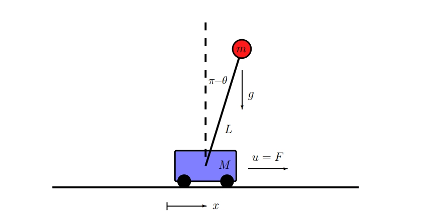

# 🚁 Task 3.1: Inverted Pendulum on a Cart (Controls & Dynamics)

## Subpart-1

### Task 3.1-A:

**Prerequisites:**
1. Follow the MATLAB installation guidelines given in Week 0. It is preferred to use the MATLAB Desktop app instead of Online, as the Online version runs very slow.
2. Have a good understanding of Subpart-1 in the Learning Resources.

**Task:**

Below are given the full non-linear dynamics of an inverted pendulum on a cart system:

$$
\dot{v} = \frac{-m^2L^2g\cos(\theta)\sin(\theta) + mL^2(mL\omega^2\sin(\theta) - \delta v) + mL^2u}{mL^2(M + m(1 - \cos(\theta)^2))}
$$

$$
\dot{\omega} = \frac{(m + M)mgL\sin(\theta) - mL\cos(\theta)(mL\omega^2\sin(\theta) - \delta v) - mL\cos(\theta)u}{mL^2(M + m(1 - \cos(\theta)^2))}
$$

> where $x$ is the cart position, $v$ is the velocity, $\theta$ is the pendulum angle, $\omega$ is the angular velocity, $m$ is the pendulum mass, $M$ is the cart mass, $L$ is the pendulum arm, $g$ is the gravitational acceleration, $\delta$ is a friction damping on the cart, and $u$ is a control force applied to the cart.

Answers to the underlying questions can be handwritten or typed:

1. Choose state vectors for this system.
2. Find out the equilibrium points for the system.
3. Write down the state space equation with an appropriate linearization for each of these equilibrium points.
4. Determine which equilibrium point corresponds to the stable equilibrium using the linearization you obtain.

You can take help of MATLAB or any other software to verify your answers.

> **Note:** In MATLAB, the function `eig(A)` returns the eigenvalues of a square matrix A.

Now, download these three MATLAB files (they should be available in this repository):
- [`pendcart.m`](./pendcart.m)
- [`simpend.m`](./simpend.m)
- [`drawpend.m`](./drawpend.m)

Load the directory in which these files are saved into MATLAB and run `simpend.m`. 

You will be able to see how the Non-Linear system of the inverted pendulum works. Note that in this, the control input $u$ is set to zero to visualize how this system looks without any controller.

This is just to prepare you and give you an intuition of the next task, where you will be controlling this system.

---

### Task 3.1-B:

Here, you will be using the full state feedback of the above system and control the system.

Download this file and save it in the same directory as the above files:
- [`pendcart_pole_placement_task1b.m`](./pendcart_pole_placement_task1b.m)

1. In this code, fill in the A and B matrices you calculated from your above linearization.
2. Fill in the empty matrices by following the comments in the file.
3. Your aim is to stabilize the system about the unstable equilibrium angle of the pendulum and at the distance $x=1$.

> **Note:** The `place(A,B,eigs)` function in MATLAB outputs a gain $K$ for which your system would have the eigenvalues defined in `eigs`.

If you have designed everything correctly, your simulation would look like this:

---

## 📥 Submit Your Work

1. Create a folder named `<YourName>_Week3_Task-3.1`.
2. Inside, include your **PDF of answers** for Task 3.1-A (questions 1-4).
3. Include your **modified MATLAB script** (`pendcart_pole_placement_task1b.m`) and a **video of the simulation** for Task 3.1-B.
4. Compress the folder into a `.zip`.
5. Upload the `.zip` file to **Google Drive** and set the sharing permissions to **"Anyone with the link can view"**.
6. Submit your Google Drive link below:

👉 **[ Submit Task 3.1 Here (Google Form) ](https://docs.google.com/forms/d/e/1FAIpQLSdZpouvYtmp3o3XAhHnEIRef9ECHF5ytXgccm_lbi_KjHgyRA/viewform?usp=publish-editor)** 👈

---
👉 **[Next: Proceed to Subpart 2 - PID Controller](./Learning_Resources_Subpart_2.md)**
